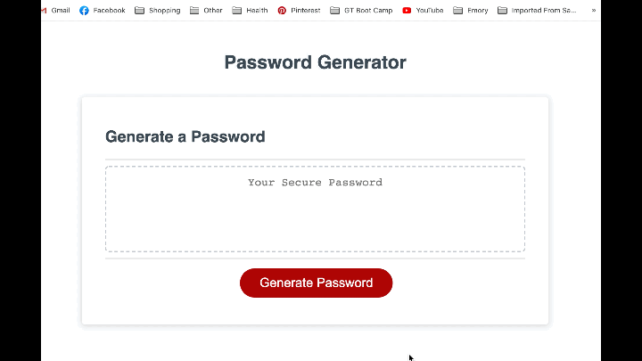

# **Random-Password-Generator**

## **Live Link**
 

## **Contributors**
@reanderson89

## **Description**
This webpage has been designed to generate a random password based on the users input. The user is able to choose the length of the password they would like and then will be asked to confirm if they want numbers, upper case, lower case, and/or special characters. This application works by adding set functions into an array of functions when the user chooses an option. After all options have either been confirmed or canceled a "for loop" will run that generates random characters from the array of functions. There is an added fail safe after the "for loop" to add a random character from every option selected to ensure the users needs are met and none of their selected options are left out.

## **Technology Stack**

* HTML, CSS, Javascript

## **Demo**
 

## **Contact**

* #### **Name:** Robert Anderson (@reanderson89)
* #### **Email:** [reanderson89@gmail.com](reanderson89@gmail.com)

## **License**
MIT